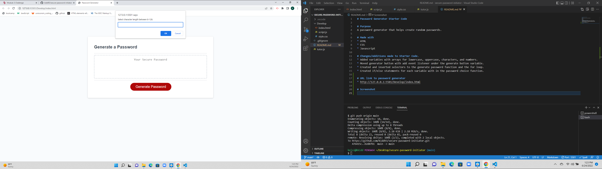

# Password Generator Starter Code

# Purpose 
A password generator that helps create random passwords.

# Made with 
* HTML
* CSS
* Javascript

# Changes/Additions made to Starter Code.
* Added variables with arrays for lowercase, uppercase, characters, and numbers.
* Moved generator button with add event listener under the generate button variable.
* Created and inserted selectors to the generate password function and the for loop.
* Created if/else statements for each variable with in the password choice function.

# URL link to password generator
* http://127.0.0.1:5501/Develop/index.html

# Screenshot
