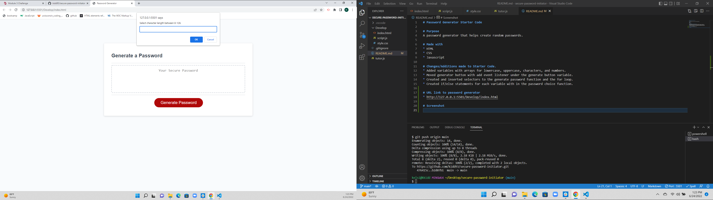

# Password Generator Starter Code

# Purpose 
A password generator that helps create random passwords.

# Made with 
* HTML
* CSS
* Javascript

# Changes/Additions made to Starter Code.
* Added const variables with strings for lowercase, uppercase, characters, and numbers.
* Created and inserted selectors to the generate password function and the for loop.
* Created let variable and if statements for each const variable with in the handleClick function.
* Condensed/simplified code for better understanding and to avoid personal confusion.
* Removed files from the "develop" folder. Deleted unnecessary files and deleted the the empty develop folder.

# URL link to password generator
* http://127.0.0.1:5501/index.html

# Screenshot
